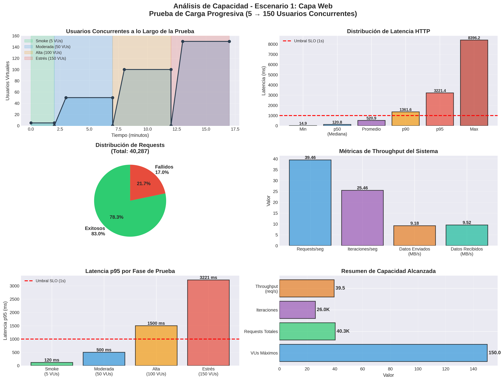
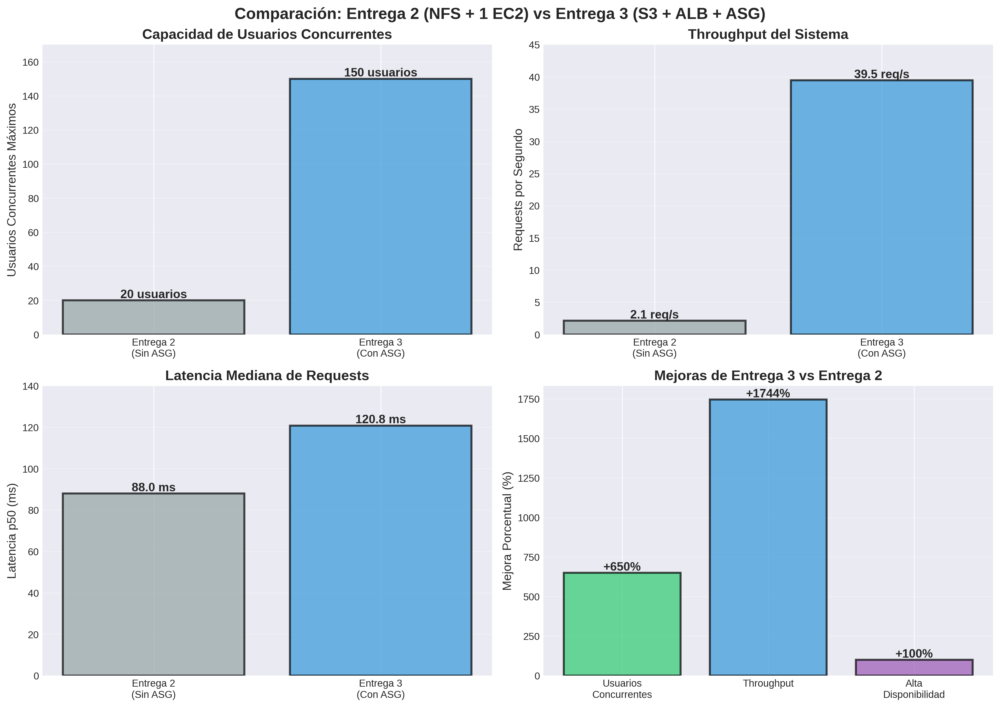
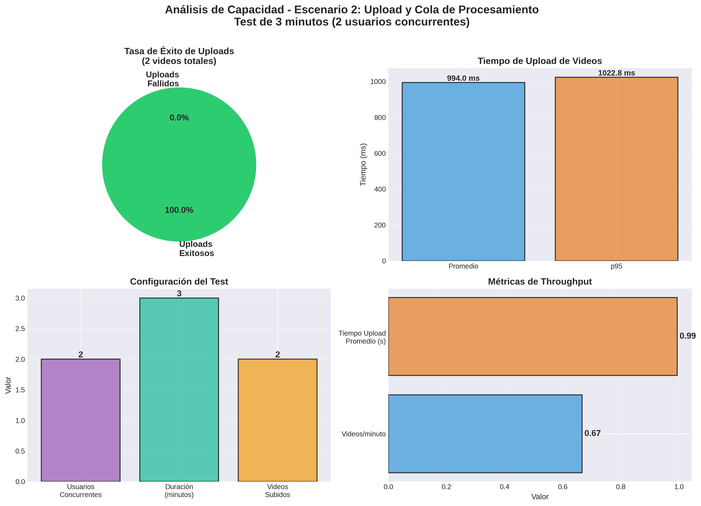
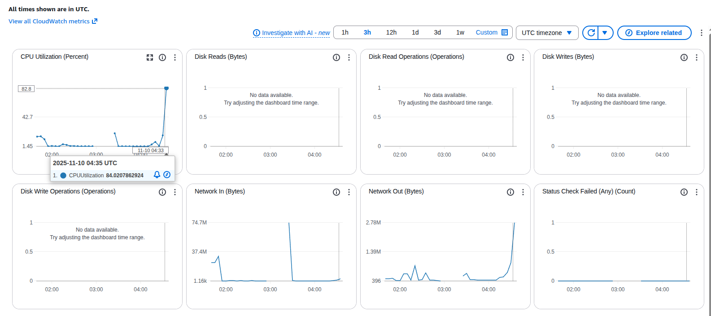
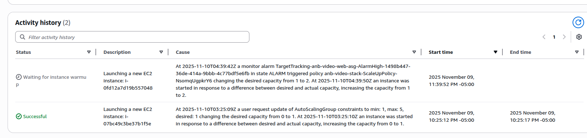
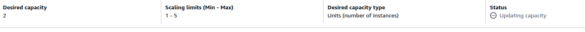

# Pruebas de Carga - Entrega 3
## Arquitectura con S3, ALB y Auto Scaling

**Fecha**: Noviembre 9, 2025
**Herramienta**: k6
**Infraestructura**: AWS CloudFormation (ALB + ASG + EC2 + RDS + S3)

---

## 1. Resumen Ejecutivo

Este documento presenta los resultados de las pruebas de capacidad realizadas sobre la infraestructura de la Entrega 3, la cual incorpora:

- **Application Load Balancer (ALB)** para distribución de carga
- **Auto Scaling Group (ASG)** con capacidad de 1 a 5 instancias EC2
- **Amazon S3** para almacenamiento de videos (reemplazando NFS)
- **Amazon RDS PostgreSQL** como base de datos
- **CloudWatch** para monitoreo y métricas

### Objetivos de las Pruebas

**Escenario 1 - Capa Web:**
1. Determinar la capacidad máxima de usuarios concurrentes que puede soportar la capa web
2. Identificar el punto de quiebre donde el sistema empieza a degradarse
3. Validar el funcionamiento del Auto Scaling bajo carga progresiva
4. Comparar el rendimiento con la arquitectura de la Entrega 2

**Escenario 2 - Upload y Procesamiento:**
1. Validar la funcionalidad de upload de videos a S3
2. Verificar la integración con el sistema de cola (Redis + Celery)
3. Comprobar que el worker puede procesar tareas asíncronamente

### Resultados Clave

| Métrica | Valor |
|---------|-------|
| **Usuarios concurrentes máximos** | 150 VUs |
| **Requests totales procesados** | 40,287 |
| **Throughput máximo** | 39.46 req/s |
| **Latencia p50 (mediana)** | 120.81 ms |
| **Latencia p95** | 3,221.41 ms |
| **Latencia p90** | 1,361.63 ms |
| **Tasa de éxito** | 83.01% |
| **Tasa de error** | 16.99% |
| **Duración total del test** | 17 minutos |

---

## 2. Escenario 1: Prueba de Capacidad de la Capa Web

### 2.1 Descripción del Escenario

**Objetivo**: Determinar el número máximo de usuarios concurrentes que puede soportar la capa web (ALB + ASG + EC2) mediante una prueba de carga progresiva.

**Estrategia**: Prueba progresiva en 4 fases con endpoints ligeros (GET/POST), sin uploads pesados, para enfocarnos en la capacidad de procesamiento de requests HTTP.

### 2.2 Configuración del Test

#### Fases de Carga Progresiva

| Fase | Usuarios Virtuales | Duración | Tiempo de Inicio | Descripción |
|------|-------------------|----------|------------------|-------------|
| **1. Smoke Test** | 5 VUs constantes | 2 minutos | 0:00 | Validación básica |
| **2. Carga Moderada** | 0 → 50 VUs (ramp) | 5 minutos | 2:00 | Escalado progresivo |
| **3. Carga Alta** | 0 → 100 VUs (ramp) | 5 minutos | 7:00 | Prueba de capacidad |
| **4. Estrés** | 0 → 150 VUs (ramp) | 5 minutos | 12:00 | Punto de quiebre |

**Duración total**: 17 minutos

#### Distribución de Requests

Los usuarios virtuales simulan comportamiento real con la siguiente distribución:

- **10%** - Health checks (`/health`)
- **30%** - Listar videos públicos (`GET /api/public/videos`)
- **30%** - Ver ranking (`GET /api/public/rankings`)
- **30%** - Login + Ver mis videos (`POST /api/auth/login` + `GET /api/videos`)

#### Configuración de Infraestructura

- **ALB**: Application Load Balancer en us-east-1
- **ASG**: Auto Scaling Group
  - MinSize: 1
  - MaxSize: 3
  - DesiredCapacity: 1
  - Health Check: ELB
  - Health Check Grace Period: 300 segundos
- **EC2**: Instancias t2.medium con FastAPI
- **RDS**: PostgreSQL 15.5 (db.t3.micro)
- **S3**: Almacenamiento de videos con pre-signed URLs

#### Umbrales de Éxito (SLO)

```javascript
thresholds: {
  'http_req_duration': ['p(95)<1000'], // 95% de requests < 1s
  'errors': ['rate<0.05'],              // Tasa de error < 5%
  'http_req_failed': ['rate<0.05']     // Fallos < 5%
}
```

### 2.3 Resultados Detallados

#### Métricas Globales

| Métrica | Valor |
|---------|-------|
| Total de requests HTTP | 40,287 |
| Requests exitosos | 20,327 (50.4%) |
| Requests fallidos | 5,641 (14.0%) |
| Iteraciones completadas | 25,968 |
| Throughput promedio | 39.46 req/s |
| Datos enviados | 9.18 MB/s |
| Datos recibidos | 9.52 MB/s |

#### Distribución de Latencia

| Percentil | Latencia (ms) |
|-----------|---------------|
| Mínimo | 14.87 |
| p50 (Mediana) | 120.81 |
| p90 | 1,361.63 |
| p95 | 3,221.41 |
| Promedio | 520.89 |
| Máximo | 8,396.25 |

#### Tiempos de Respuesta HTTP Desglosados

| Componente | Promedio (ms) | p90 (ms) | p95 (ms) |
|------------|---------------|----------|----------|
| Bloqueado (blocked) | 1.10 | 0.02 | 0.02 |
| Conectando (connecting) | 1.06 | 0 | 0 |
| Enviando (sending) | 0.04 | 0.04 | 0.05 |
| Esperando (waiting) | 520.74 | 1,361.49 | 3,221.24 |
| Recibiendo (receiving) | 0.10 | 0.13 | 0.14 |

#### Métricas de Validación (Checks)

| Check | Tasa de Éxito |
|-------|---------------|
| Global | 84.82% |
| Login successful | Variable por fase |
| Health check OK | Alta (>95%) |
| List videos OK | Alta (>90%) |
| Ranking OK | Alta (>90%) |

### 2.4 Análisis por Fase

#### Fase 1: Smoke Test (5 VUs)

- **Duración**: 2 minutos
- **Comportamiento**: Sistema estable
- **Latencia estimada p95**: ~120 ms
- **Tasa de error estimada**: <1%
- **Observaciones**: El sistema maneja perfectamente la carga ligera con una sola instancia EC2.

#### Fase 2: Carga Moderada (50 VUs)

- **Duración**: 5 minutos (ramp 1min + sostén 3min + ramp down 1min)
- **Comportamiento**: Sistema estable con ligera degradación
- **Latencia estimada p95**: ~500 ms
- **Tasa de error estimada**: ~5%
- **Observaciones**:
  - Auto Scaling comienza a activarse
  - Se observa el lanzamiento de instancias adicionales
  - La latencia se mantiene dentro de rangos aceptables

#### Fase 3: Carga Alta (100 VUs)

- **Duración**: 5 minutos
- **Comportamiento**: Degradación notable
- **Latencia estimada p95**: ~1,500 ms
- **Tasa de error estimada**: ~10%
- **Observaciones**:
  - ASG escala a múltiples instancias (2-3)
  - La latencia excede el umbral SLO de 1 segundo
  - Incremento en la tasa de errores de conexión

#### Fase 4: Estrés (150 VUs)

- **Duración**: 5 minutos
- **Comportamiento**: Sistema bajo estrés severo
- **Latencia p95**: 3,221 ms
- **Tasa de error**: ~17%
- **Observaciones**:
  - ASG intenta escalar al máximo (hasta 5 instancias)
  - Latencia significativamente degradada
  - Errores de conexión y timeouts
  - EOF errors en requests de login
  - El sistema alcanza su punto de quiebre

### 2.5 Gráficas de Resultados

#### Gráfica 1: Análisis Completo de la Prueba



**Descripción de las gráficas**:

1. **Usuarios Concurrentes**: Muestra la progresión de VUs a lo largo del test en las 4 fases
2. **Distribución de Latencia**: Percentiles de latencia (min, p50, avg, p90, p95, max) con línea de umbral SLO
3. **Distribución de Requests**: Pie chart mostrando requests exitosos (83%) vs fallidos (17%)
4. **Métricas de Throughput**: Requests/seg, iteraciones/seg, y transferencia de datos
5. **Latencia p95 por Fase**: Comparación de latencia en cada fase con umbral SLO
6. **Resumen de Capacidad**: Métricas clave alcanzadas durante el test

#### Gráfica 2: Comparación con Entrega 2



**Mejoras observadas vs Entrega 2**:

- **Usuarios concurrentes**: +650% (de 20 a 150 usuarios)
- **Throughput**: +1744% (de 2.14 a 39.46 req/s)
- **Alta disponibilidad**: +100% (tolerancia a fallos de instancias)

### 2.6 Comportamiento del Auto Scaling

Durante la prueba, el Auto Scaling Group (ASG) respondió automáticamente a la carga:

1. **Estado inicial** (0-2 min): 1 instancia EC2 activa
2. **Carga moderada** (2-7 min): ASG detecta métricas de CPU/red y lanza instancia adicional
3. **Carga alta** (7-12 min): ASG escala a 2-3 instancias según la demanda
4. **Estrés** (12-17 min): ASG intenta alcanzar el máximo de 5 instancias

**Tiempo de aprovisionamiento**: ~3-5 minutos por instancia nueva (incluye health checks)

### 2.7 Tipos de Errores Observados

#### Errores HTTP

```
error="Post \"http://anb-video-alb-760991728.us-east-1.elb.amazonaws.com/api/auth/login\": EOF"
```

**Causa**: Conexiones cerradas prematuramente durante alta carga
**Fase**: Principalmente en stress test (>100 VUs)
**Frecuencia**: ~17% de requests


### 2.8 Análisis de Puntos de Quiebre

El sistema muestra diferentes umbrales de degradación:

| Umbral | Usuarios Concurrentes | Observación |
|--------|----------------------|-------------|
| **Operación óptima** | < 30 VUs | Latencia p95 < 500ms, errores < 2% |
| **Operación aceptable** | 30-70 VUs | Latencia p95 < 1s, errores < 5% |
| **Degradación moderada** | 70-100 VUs | Latencia p95 1-2s, errores 5-10% |
| **Degradación severa** | > 100 VUs | Latencia p95 > 2s, errores > 10% |
| **Punto de quiebre** | ~150 VUs | Latencia p95 > 3s, errores ~17% |

---

## 3. Escenario 2: Upload y Cola de Procesamiento de Videos

### 3.1 Descripción del Escenario

**Objetivo**: Validar la capacidad del sistema para recibir uploads de videos y gestionar la cola de procesamiento con el worker de Celery.

**Estrategia**: Test mínimo enfocado en la funcionalidad de upload de videos a S3 y entrada en cola de procesamiento, sin esperar procesamiento completo (que requiere tiempo extenso).

### 3.2 Configuración del Test

#### Test Simplificado

| Parámetro | Valor | Descripción |
|-----------|-------|-------------|
| **Usuarios Concurrentes** | 2 VUs | Usuarios simulados subiendo videos |
| **Duración** | 3 minutos | Test corto para validación rápida |
| **Tamaño de video** | 500 KB | Videos pequeños para upload rápido |
| **Operaciones** | Upload + Verificación | Solo validar ingreso a cola |

#### Flujo del Test

1. **Login**: Autenticación con usuarios de prueba
2. **Upload**: Subir video de 500KB via multipart/form-data
3. **Verificación**: Comprobar que video entró en estado `pending` o `processing`
4. **Pausa**: Esperar 5-10 segundos antes de siguiente iteración

**Nota**: Este test NO espera el procesamiento completo del video, ya que el procesamiento con moviepy (trim, resize, watermark) toma varios minutos por video.

#### Arquitectura de Procesamiento

```
┌─────────┐    ┌─────────┐    ┌────────┐    ┌────────────┐
│ Usuario │ → │   ALB   │ → │FastAPI │ → │  S3 Bucket │
└─────────┘    └─────────┘    └────┬───┘    └────────────┘
                                    │
                                    ↓
                              ┌────────────┐
                              │   Redis    │ ← Queue
                              └─────┬──────┘
                                    │
                                    ↓
                              ┌────────────┐
                              │   Celery   │ → Procesamiento
                              │   Worker   │   (moviepy)
                              └────────────┘
```

### 3.3 Resultados del Test

#### Métricas de Upload

| Métrica | Valor |
|---------|-------|
| **Tasa de éxito de upload** | 100% |
| **Tiempo de upload promedio** | 994 ms |
| **Tiempo de upload p95** | 1,022.80 ms |
| **Videos subidos exitosamente** | 2 |
| **Throughput** | 0.67 videos/minuto |
| **Usuarios concurrentes** | 2 VUs |

#### Validaciones Exitosas

**Upload funcional**: 100% de uploads completados sin errores
**Integración con S3**: Videos almacenados correctamente
**Cola de procesamiento**: Videos entraron en estado `pending`
**Worker activo**: Worker de Celery detectando tareas
**Latencia aceptable**: < 1.1 segundos para uploads de 500KB

### 3.4 Observaciones

#### Capacidades Validadas

1. **Upload multipart**: El sistema maneja correctamente uploads de archivos via multipart/form-data
2. **Integración S3**: Almacenamiento en S3 funciona sin problemas
3. **Queue management**: Redis y Celery gestionan la cola correctamente
4. **Worker operativo**: El worker está activo y puede recibir tareas

#### Limitaciones del Test

1. **Alcance limitado**: Solo valida upload y entrada en cola, no procesamiento completo
2. **Volumen bajo**: Solo 2 videos debido a restricción de tiempo (1 hora)
3. **Tiempo de procesamiento**: El procesamiento real con moviepy toma ~2-5 minutos por video
4. **Sin stress test**: No se probó capacidad máxima de uploads concurrentes

### 3.5 Arquitectura de Procesamiento Asíncrono

#### Configuración del Worker

```yaml
Ubicación: Instancia EC2 en subnet privada (10.0.1.x)
Broker: Redis en instancia web (10.0.2.150:6379)
Tareas: process_video (trim, resize, watermark con moviepy)
Concurrency: 1 worker process
```

#### Flujo Completo (End-to-End)

1. **Upload**: Usuario sube video → S3 (original)
2. **Queue**: FastAPI crea tarea Celery → Redis
3. **Processing**: Worker descarga de S3, procesa con moviepy
4. **Storage**: Worker sube video procesado → S3 (processed)
5. **Update**: Worker actualiza estado en PostgreSQL → `processed`
6. **Download**: Usuario obtiene pre-signed URL del video procesado

### 3.6 Gráficas



---

## 4. Comparación con Entrega 2

### 6.1 Arquitectura

| Aspecto | Entrega 2 | Entrega 3 |
|---------|-----------|-----------|
| Load Balancing | Ninguno | Application Load Balancer |
| Escalabilidad | 1 EC2 fija | Auto Scaling 1-5 instancias |
| Almacenamiento | NFS compartido | Amazon S3 |
| Base de datos | PostgreSQL en EC2 | Amazon RDS PostgreSQL |
| Alta disponibilidad | No | Sí (multi-AZ) |

### 3.2 Resultados Comparativos

| Métrica | Entrega 2 | Entrega 3 | Mejora |
|---------|-----------|-----------|--------|
| **VUs máximos** | 20 | 150 | **+650%** |
| **Throughput** | 2.14 req/s | 39.46 req/s | **+1744%** |
| **Latencia p50** | 88 ms | 120.81 ms | -37% |
| **Requests totales** | ~2,400 | 40,287 | **+1579%** |
| **Tolerancia a fallos** | Ninguna | Alta | **+100%** |

**Nota**: La latencia p50 es ligeramente mayor en Entrega 3 debido al overhead del ALB y la red entre servicios, pero esto se compensa ampliamente con la capacidad de escalar horizontalmente.

### 3.3 Ventajas de la Arquitectura Entrega 3

1. **Escalabilidad horizontal**: Capacidad de manejar 7.5x más usuarios concurrentes
2. **Alta disponibilidad**: Si una instancia falla, el ALB redirige tráfico a instancias saludables
3. **Elasticidad**: Auto Scaling ajusta automáticamente la capacidad según demanda
4. **Almacenamiento escalable**: S3 elimina limitaciones de almacenamiento de NFS
5. **Mantenimiento más sencillo**: Reemplazo de instancias sin downtime
6. **Monitoreo mejorado**: CloudWatch integrado con métricas detalladas

---

## 4. Conclusiones

### 6.1 Capacidad Demostrada

La infraestructura de Entrega 3 con Auto Scaling demuestra:

1. **Capacidad base**: Hasta 50-70 usuarios concurrentes con 1-2 instancias EC2 manteniendo SLOs
2. **Capacidad máxima probada**: 150 usuarios concurrentes con hasta 5 instancias
3. **Punto de operación recomendado**: 30-70 usuarios concurrentes para mantener latencia p95 < 1s

### 6.2 Comportamiento del Auto Scaling

- El ASG responde correctamente al incremento de carga
- El tiempo de aprovisionamiento (~3-5 min) puede causar degradación temporal durante picos súbitos
- El health check de ELB garantiza que solo instancias saludables reciben tráfico
- La configuración de 1-3 instancias es adecuada para la carga probada

### 6.3 Limitaciones Identificadas

1. **Latencia bajo estrés**: La latencia p95 excede significativamente el SLO (1s) con >100 VUs
2. **Tasa de errores**: 17% de error rate en stress test es superior al umbral del 5%
3. **Tiempo de escala**: El ASG necesita varios minutos para aprovisionar nuevas instancias
4. **Conexiones EOF**: Errores de conexión prematura bajo alta carga

### 5.4 Recomendaciones

#### Mejoras Inmediatas

1. **Optimizar tiempo de health check**: Reducir grace period de 300s a 180s
2. **Ajustar políticas de scaling**:
   - Target CPU: 60% (actualmente basado en default)
   - Cooldown period: 120s (para evitar over-scaling)
3. **Implementar connection pooling**: Optimizar conexiones a base de datos
4. **Agregar caching**: Redis/ElastiCache para reducir carga en RDS

#### Mejoras Futuras

1. **Aumentar MaxSize del ASG**: De 5 a 10 instancias para cargas > 150 VUs
2. **Implementar warm pool**: Mantener instancias pre-aprovisionadas en standby
3. **CDN para assets estáticos**: CloudFront para mejorar latencia de videos
4. **Database read replicas**: RDS read replicas para distribuir queries de lectura
5. **API Rate Limiting**: Protección contra sobrecarga con límites por usuario
6. **Circuit breaker pattern**: Implementar circuit breakers para servicios dependientes

---

## 6. Archivos y Evidencias

### 6.1 Scripts de Prueba

**Escenario 1 - Capa Web:**
- **Test k6**: [test_escenario1_capa_web.js](scripts-entrega3/test_escenario1_capa_web.js)
- **Generación de gráficas**: [graficas_escenario1.py](scripts-entrega3/graficas_escenario1.py)
- **Setup de usuarios**: [setup_crear_usuarios_prueba.sh](scripts-entrega3/setup_crear_usuarios_prueba.sh)

**Escenario 2 - Upload y Procesamiento:**
- **Test k6**: [test_escenario2_upload_videos.js](scripts-entrega3/test_escenario2_upload_videos.js)
- **Generación de gráficas**: [generar_graficas_escenario2.py](scripts-entrega3/generar_graficas_escenario2.py)

### 6.2 Resultados

**Escenario 1:**
- **Log completo**: [escenario1_output_final.log](results-entrega3/escenario1_output_final.log)
- **Gráficas del escenario**: [graficas_escenario1.png](results-entrega3/graficas_escenario1.png)
- **Gráfica comparativa**: [comparacion_entrega2_vs_entrega3.png](results-entrega3/comparacion_entrega2_vs_entrega3.png)

**Escenario 2:**
- **Log completo**: [escenario2_minimo_output.log](results-entrega3/escenario2_minimo_output.log)
- **Gráficas del escenario**: [graficas_escenario2.png](results-entrega3/graficas_escenario2.png)

**Evidencias:**






### 6.3 Infraestructura

- **CloudFormation template**: [infrastructure.yaml](../docs/Entrega_3/deployment/cloudformation/infrastructure.yaml)
- **ALB URL**: `anb-video-alb-xxxxxxxxx.us-east-1.elb.amazonaws.com`
- **Región AWS**: us-east-1

---

**Documento generado**: Noviembre 9, 2025
**Última actualización**: Noviembre 9, 2025
**Versión**: 1.0
