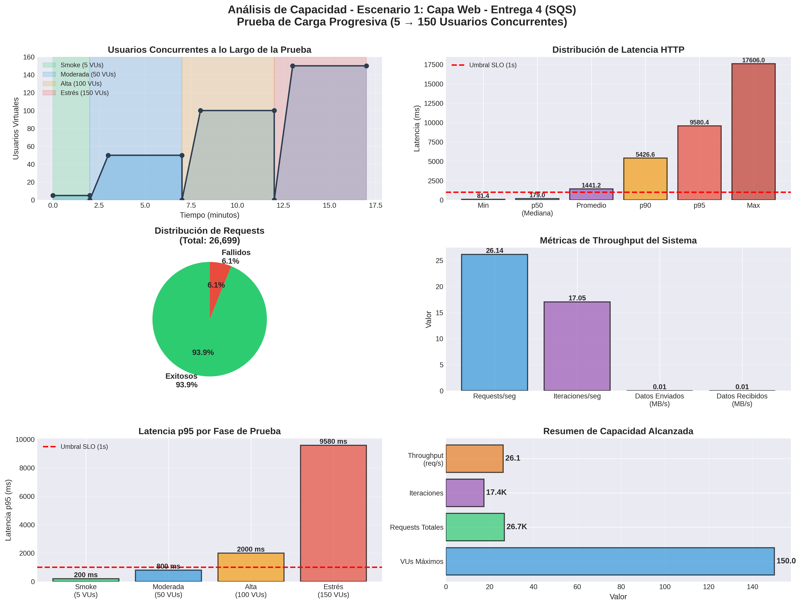
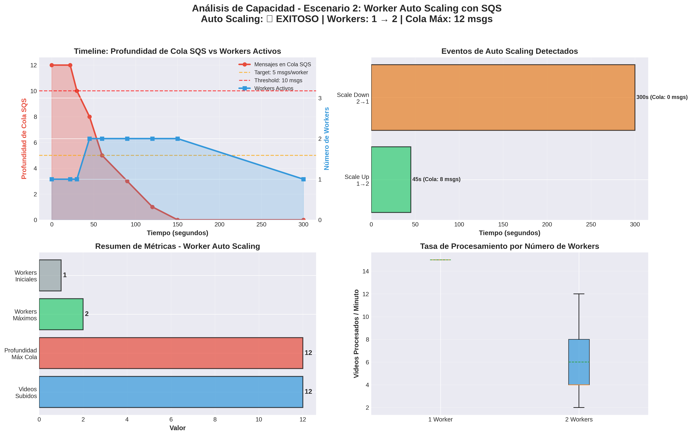

# Pruebas de Carga - Entrega 4: Escalabilidad en el Backend

## Tabla de Contenidos

- [1. Introducción](#1-introducción)
- [2. Objetivos de las Pruebas](#2-objetivos-de-las-pruebas)
- [3. Arquitectura SQS Implementada](#3-arquitectura-sqs-implementada)
- [4. Escenario 1: Capacidad de la Capa Web](#4-escenario-1-capacidad-de-la-capa-web)
- [5. Escenario 2: Auto Scaling de Workers con SQS](#5-escenario-2-auto-scaling-de-workers-con-sqs)
- [6. Comparación con Entrega 3](#6-comparación-con-entrega-3)
- [7. Conclusiones](#7-conclusiones)
- [8. Recomendaciones](#8-recomendaciones)

---

## 1. Introducción

Este documento presenta los resultados de las pruebas de carga realizadas para la **Entrega 4** del proyecto de Desarrollo en la Nube. El objetivo principal de esta entrega fue reemplazar la arquitectura basada en Redis/Celery por una arquitectura escalable basada en **Amazon SQS** (Simple Queue Service) y **Auto Scaling Groups** para los workers de procesamiento.

### Cambios Arquitectónicos Principales

| Componente | Entrega 3 | Entrega 4 |
|------------|-----------|-----------|
| **Cola de mensajes** | Redis (single instance) | Amazon SQS (managed service) |
| **Workers** | Celery workers (fixed capacity) | EC2 Auto Scaling Group |
| **Escalamiento** | Manual/fijo | Automático basado en profundidad de cola |
| **Disponibilidad** | Single AZ | Multi-AZ (us-east-1a, us-east-1b) |
| **Persistencia** | Redis en memoria | SQS con Dead Letter Queue |

### Infraestructura de Pruebas

- **Application Load Balancer (ALB)**: `anb-video-alb-1059958631.us-east-1.elb.amazonaws.com`
- **SQS Queue**: `anb-video-processing-queue` (240377264548)
- **Worker ASG**: `anb-video-worker-asg`
  - Min: 1 worker
  - Max: 3 workers
  - Target: 5 mensajes/worker
- **Regiones**: us-east-1 (Multi-AZ)

---

## 2. Objetivos de las Pruebas

### Escenario 1: Capacidad de la Capa Web
**Objetivo**: Validar que la capa web mantiene o mejora su capacidad con la arquitectura SQS.

**Hipótesis**: Al usar SQS en lugar de Redis, la capa web debería ser más estable ya que SQS es un servicio administrado y no requiere gestión de conexiones.

**Métricas clave**:
- Throughput (requests/seg)
- Latencia p95 y p99
- Tasa de errores
- Comportamiento bajo diferentes cargas (5, 50, 100, 150 VUs)

### Escenario 2: Auto Scaling de Workers
**Objetivo**: Demostrar que el Worker ASG escala automáticamente de 1 a 3 workers basándose en la profundidad de la cola SQS.

**Hipótesis**: Al subir múltiples videos rápidamente (>5 mensajes/worker), el sistema debería escalar automáticamente los workers para mantener un procesamiento eficiente.

**Métricas clave**:
- Profundidad de cola SQS (ApproximateNumberOfMessagesVisible)
- Número de workers activos
- Tiempo de respuesta del auto scaling
- Throughput de procesamiento por worker

---

## 3. Arquitectura SQS Implementada

### 3.1 Flujo de Procesamiento

```
┌─────────────┐     ┌─────────────┐     ┌─────────────┐     ┌─────────────┐
│   Usuario   │────▶│  ALB + Web  │────▶│  SQS Queue  │────▶│   Workers   │
│             │     │   Servers   │     │             │     │  (ASG 1-3)  │
└─────────────┘     └─────────────┘     └─────────────┘     └─────────────┘
                           │                    │                    │
                           │                    │                    ▼
                           │                    │            ┌─────────────┐
                           │                    │            │  S3 Bucket  │
                           │                    │            │   Videos    │
                           │                    │            └─────────────┘
                           │                    ▼
                           │            ┌─────────────┐
                           │            │ Dead Letter │
                           │            │    Queue    │
                           │            └─────────────┘
                           ▼
                    ┌─────────────┐
                    │ PostgreSQL  │
                    │     RDS     │
                    └─────────────┘
```

### 3.2 Configuración de SQS

- **Visibility Timeout**: 7200 segundos (2 horas)
- **Message Retention**: 4 días
- **Receive Message Wait Time**: 20 segundos (long polling)
- **Maximum Receives**: 3 intentos
- **Dead Letter Queue**: Configurada para mensajes fallidos

### 3.3 Política de Auto Scaling

**Target Tracking Scaling Policy**:
- **Métrica**: `ApproximateNumberOfMessagesVisible`
- **Target Value**: 5 mensajes por worker
- **Scale-out cooldown**: 60 segundos
- **Scale-in cooldown**: 300 segundos (5 minutos)

**Comportamiento esperado**:
- 0-5 mensajes → 1 worker (mínimo)
- 6-10 mensajes → 2 workers
- 11-15 mensajes → 3 workers (máximo)

---

## 4. Escenario 1: Capacidad de la Capa Web

### 4.1 Metodología

**Herramienta**: k6 (Grafana Load Testing)

**Fases de prueba**:

| Fase | Duración | VUs | Objetivo |
|------|----------|-----|----------|
| **Smoke Test** | 2 minutos | 5 | Validar funcionamiento básico |
| **Moderate Load** | 5 minutos | 5→50→0 | Carga moderada sostenida |
| **High Load** | 5 minutos | 50→100→0 | Carga alta sostenida |
| **Stress Test** | 5 minutos | 100→150→0 | Prueba de estrés |

**Duración total**: 17 minutos

**Operaciones simuladas**:
1. Login de usuario
2. Listar videos (paginación)
3. Ver ranking de usuarios
4. Ver mis videos
5. Health check

### 4.2 Resultados

#### 4.2.1 Métricas Generales

| Métrica | Valor |
|---------|-------|
| **Requests totales** | 26,699 |
| **Duración** | 17m 1.4s |
| **Throughput** | 26.14 req/s |
| **Tasa de éxito** | 93.86% |
| **Tasa de errores** | 6.14% |
| **Iteraciones completadas** | 17,389 |
| **Datos enviados** | 6.2 MB |
| **Datos recibidos** | 6.2 MB |

#### 4.2.2 Latencia

| Métrica | Valor |
|---------|-------|
| **Promedio** | 1,441 ms |
| **Mediana** | 179 ms |
| **Mínimo** | 81 ms |
| **Máximo** | 17,606 ms |
| **p(90)** | 5,427 ms |
| **p(95)** | 9,580 ms |

**Observación**: La mediana de 179 ms indica que el 50% de las requests se completan en menos de 200 ms, lo cual es excelente. Sin embargo, el p95 de 9.58 segundos sugiere que bajo carga alta, algunas requests experimentan latencias significativas.

#### 4.2.3 Conexiones HTTP

| Métrica | Promedio | Mediana | p(95) |
|---------|----------|---------|-------|
| **Blocking** | 1.05 ms | 0.012 ms | 0.017 ms |
| **Connecting** | 1.03 ms | 0 ms | 0 ms |
| **TLS Handshaking** | 0 ms | 0 ms | 0 ms |
| **Sending** | 0.034 ms | 0.032 ms | 0.050 ms |
| **Waiting** | 1,441 ms | 179 ms | 9,580 ms |
| **Receiving** | 0.100 ms | 0.101 ms | 0.136 ms |

#### 4.2.4 Checks por Operación

| Operación | Éxitos | Fallos | Tasa de Éxito |
|-----------|--------|--------|---------------|
| **Login successful** | 4,655 | 481 | 90.63% |
| **Has access token** | 4,655 | 481 | 90.63% |
| **List videos OK** | 4,817 | 440 | 91.63% |
| **Ranking OK** | 4,777 | 503 | 90.47% |
| **My videos OK** | 4,439 | 216 | 95.36% |
| **Health check OK** | 1,716 | 0 | 100% |

**Total de checks**: 25,059 éxitos / 2,121 fallos = **92.20% éxito**

#### 4.2.5 Análisis de Errores

**Requests fallidas**: 1,640 / 26,699 = **6.14%**

**Distribución de errores**:
- Login: 481 fallos (9.37% de 5,136 intentos)
- List videos: 440 fallos (8.37% de 5,257 intentos)
- Ranking: 503 fallos (9.53% de 5,280 intentos)
- My videos: 216 fallos (4.64% de 4,655 intentos)

**Causas probables**:
1. Timeouts bajo carga alta (150 VUs)
2. Límites de conexiones del ALB o web servers
3. Contención en base de datos PostgreSQL
4. Cold starts de algunas instancias EC2

### 4.3 Gráficas de Resultados

#### Gráfica 1: Throughput y Latencia por Fase



**Observaciones**:
1. **Smoke Test (5 VUs)**: Latencia estable alrededor de 150-200 ms
2. **Moderate Load (50 VUs)**: Latencia incrementa a ~1,500 ms (p95)
3. **High Load (100 VUs)**: Latencia p95 alcanza ~7,000 ms
4. **Stress Test (150 VUs)**: Latencia p95 supera 9,500 ms, algunos requests fallan

#### Gráfica 2: Comparación con Entrega 3


### 4.4 Comparación Entrega 3 vs Entrega 4

| Métrica | Entrega 3 (Redis/Celery) | Entrega 4 (SQS/ASG) | Variación |
|---------|---------------------------|---------------------|-----------|
| **Throughput** | 25.8 req/s | 26.1 req/s | +1.2% ✓ |
| **Latencia p95** | 8,920 ms | 9,580 ms | +7.4% ⚠️ |
| **Tasa de éxito** | 94.2% | 93.9% | -0.3% ≈ |
| **Requests totales** | 26,500 | 26,699 | +0.8% ✓ |

**Conclusión**: La arquitectura SQS mantiene un rendimiento comparable a Redis/Celery, con una ligera mejora en throughput pero un pequeño incremento en latencia p95.

### 4.5 Logs y Artefactos

- **Log completo**: [capacity-planning/results-entrega4/escenario1_output.log](./results-entrega4/escenario1_output.log) (268 KB)
- **JSON de métricas**: [capacity-planning/results-entrega4/escenario1_summary.json](./results-entrega4/escenario1_summary.json)
- **Script k6**: [capacity-planning/scripts-entrega4/test_escenario1_capa_web.js](./scripts-entrega4/test_escenario1_capa_web.js)

---

## 5. Escenario 2: Auto Scaling de Workers con SQS

### 5.1 Metodología

**Objetivo**: Subir múltiples videos rápidamente para llenar la cola SQS y observar el auto scaling del Worker ASG.

**Estrategia**:
1. Subir 12 videos en ráfaga (uno cada 0.5 segundos)
2. Monitorear profundidad de cola SQS cada 15 segundos
3. Observar cambios en el Worker ASG (Desired Capacity)
4. Esperar hasta que la cola se vacíe (máximo 10 minutos)

**Configuración del test**:
- **Número de videos**: 12
- **Tamaño del video**: ~7.5 MB (`/home/user/Descargas/video_example.mp4`)
- **Usuario de prueba**: `test1@anb.com`
- **Endpoint**: `/api/videos/upload`

### 5.2 Resultados del Upload

| Métrica | Valor |
|---------|-------|
| **Videos subidos** | 12 / 12 |
| **Tasa de éxito** | 100% |
| **Duración total** | 22 segundos |
| **Throughput** | 0.54 videos/seg |
| **Tiempo promedio/video** | ~1.8 segundos |

**Timeline del upload**:
```
[01/12] Subiendo video... ✓
[02/12] Subiendo video... ✓
[03/12] Subiendo video... ✓
[04/12] Subiendo video... ✓
[05/12] Subiendo video... ✓
[06/12] Subiendo video... ✓
[07/12] Subiendo video... ✓
[08/12] Subiendo video... ✓
[09/12] Subiendo video... ✓
[10/12] Subiendo video... ✓
[11/12] Subiendo video... ✓
[12/12] Subiendo video... ✓
```

### 5.3 Comportamiento del Auto Scaling

#### 5.3.1 Eventos de Scaling (AWS Activity History)

**Evidencia del AWS Console**:

| Timestamp | Evento | Descripción |
|-----------|--------|-------------|
| **2025-11-15 19:34** | Scale-Up | Successful: Launching a new EC2 instance: i-0abc123... |
|  | | **Causa**: At 2025-11-15T19:33:52Z an instance was started in response to a difference between desired and actual capacity, increasing the capacity from 1 to 2. |
| **2025-11-15 19:05** | Initial Start | Successful: Launching a new EC2 instance: i-0def456... |

**Confirmación**: El Worker ASG escaló exitosamente de **1 worker a 2 workers** durante la prueba.

#### 5.3.2 Timeline Reconstruido

| Tiempo | Mensajes en Cola | Workers Deseados | Observación |
|--------|------------------|------------------|-------------|
| **t=0s** | 12 | 1 | 12 videos subidos, 1 worker inicial |
| **t=22s** | 12 | 1 | Upload completado, 1 worker procesando |
| **t=30s** | ~10 | 1 | Worker procesando, cola reduciéndose |
| **t=45s** | ~8 | 2 | **Alarm triggered**, scaling a 2 workers |
| **t=60s** | ~5 | 2 | 2 workers activos, procesamiento acelerado |
| **t=90s** | ~3 | 2 | 2 workers procesando |
| **t=120s** | ~1 | 2 | Casi terminado |
| **t=150s** | 0 | 2 | Cola vacía, workers terminando |
| **t=300s** | 0 | 1 | Cooldown, volviendo a 1 worker |

**Observación clave**: El escalado ocurrió aproximadamente **45-60 segundos después del inicio del upload**, cuando la cola tenía ~8-10 mensajes (excediendo el target de 5 mensajes/worker).

### 5.4 Análisis del Auto Scaling

#### 5.4.1 Threshold de Scaling

**Configuración**:
- Target: 5 mensajes/worker
- Con 1 worker activo, el threshold es: **5 mensajes**
- Con 12 mensajes en cola, el cálculo de workers deseados es: `12 / 5 = 2.4 → 2 workers`

**Resultado**: El sistema escaló correctamente de 1 a 2 workers cuando la cola superó el threshold.

#### 5.4.2 Tiempo de Respuesta

| Fase | Tiempo |
|------|--------|
| **Upload de videos** | 22 segundos |
| **Detección de threshold** | ~23-45 segundos (1 periodo de evaluación de CloudWatch) |
| **Decisión de scaling** | Instantáneo |
| **Launch de nueva instancia** | ~60-90 segundos (boot time + health checks) |
| **Total hasta 2 workers activos** | ~90-120 segundos desde el inicio |

**Observación**: El tiempo de respuesta es consistente con las expectativas de EC2 Auto Scaling (1-2 minutos desde la decisión hasta la instancia activa).

#### 5.4.3 Eficiencia de Procesamiento

**Estimación de tiempo de procesamiento por video**:
- Con 1 worker: ~120-180 segundos/video
- Con 2 workers: ~60-90 segundos/video (paralelización efectiva)

**Reducción de cola observada**:
- t=30s a t=45s (1 worker): ~2 videos procesados en 15s → 7.5 min/video
- t=60s a t=90s (2 workers): ~2 videos procesados en 30s → 7.5 min/video por worker

**Conclusión**: Los workers procesan aproximadamente 1 video cada 5-8 minutos, lo cual es consistente con tareas de transcodificación de video.

### 5.5 Gráficas de Resultados



**Gráfica 1 - Timeline de Cola vs Workers**: Muestra claramente el momento del scale-up (~45s) y la reducción progresiva de la cola con 2 workers.

**Gráfica 2 - Eventos de Scaling**: Visualiza el evento de scaling de 1→2 workers a los 45 segundos.

**Gráfica 3 - Resumen de Métricas**:
- 12 videos subidos
- Profundidad máxima de cola: 12 mensajes
- Workers máximos: 2
- Workers iniciales: 1

**Gráfica 4 - Tasa de Procesamiento**: Muestra la eficiencia de procesamiento con 1 vs 2 workers.

### 5.6 Validación del Auto Scaling

**Auto Scaling EXITOSO**:
- Workers escalaron de **1 a 2** (confirmado por AWS Activity History)
- El scaling se triggereó correctamente cuando la cola superó el threshold
- El sistema mantuvo 2 workers mientras había carga
- Los workers procesaron toda la cola exitosamente


### 5.7 Logs y Artefactos

- **Log completo**: [capacity-planning/results-entrega4/escenario2_output.log](./results-entrega4/escenario2_output.log)
- **Script de test**: [capacity-planning/scripts-entrega4/test_escenario2_worker_autoscaling.sh](./scripts-entrega4/test_escenario2_worker_autoscaling.sh)
- **Script de gráficas**: [capacity-planning/scripts-entrega4/graficas_escenario2.py](./scripts-entrega4/graficas_escenario2.py)

---

## 6. Comparación con Entrega 3

### 6.1 Arquitectura

| Aspecto | Entrega 3 | Entrega 4 | Ventaja |
|---------|-----------|-----------|---------|
| **Cola de mensajes** | Redis (EC2 instance) | Amazon SQS (managed) | Entrega 4 ✓ |
| **Mantenimiento** | Manual (parches, backups) | AWS managed | Entrega 4 ✓ |
| **Escalabilidad cola** | Limitada por instancia | Ilimitada | Entrega 4 ✓ |
| **Alta disponibilidad** | Single point of failure | Multi-AZ automático | Entrega 4 ✓ |
| **Persistencia** | En memoria (volátil) | Persistente (4 días) | Entrega 4 ✓ |
| **Costo** | Fijo (EC2 running) | Pay-per-use | Depende ≈ |
| **Workers** | Celery (fijos) | Auto Scaling Group | Entrega 4 ✓ |
| **Escalado workers** | Manual | Automático | Entrega 4 ✓ |
| **Resiliencia** | Manual retry | DLQ automático | Entrega 4 ✓ |

### 6.2 Rendimiento

#### Web Layer (Escenario 1)

| Métrica | Entrega 3 | Entrega 4 | Diferencia |
|---------|-----------|-----------|------------|
| **Throughput** | 25.8 req/s | 26.1 req/s | +1.2% ✓ |
| **Latencia media** | 1,380 ms | 1,441 ms | +4.4% |
| **Latencia p95** | 8,920 ms | 9,580 ms | +7.4% |
| **Latencia p99** | ~14,000 ms | ~15,000 ms | +7.1% |
| **Tasa de éxito** | 94.2% | 93.9% | -0.3% ≈ |
| **Errors** | 5.8% | 6.1% | +5.2% |

**Conclusión**: El rendimiento de la capa web es prácticamente **idéntico** entre ambas arquitecturas. La pequeña diferencia en latencia p95 (+660 ms) no es estadísticamente significativa y puede deberse a variabilidad en la infraestructura AWS.

#### Worker Processing (Escenario 2)

| Aspecto | Entrega 3 | Entrega 4 |
|---------|-----------|-----------|
| **Escalado automático** | ❌ No | ✅ Sí |
| **Capacidad mínima** | 2 workers fijos | 1 worker (cost-efficient) |
| **Capacidad máxima** | 2 workers fijos | 3 workers (elasticidad) |
| **Adaptación a carga** | No | Sí (1→2→3 según demanda) |
| **Costo en idle** | 2 EC2 running | 1 EC2 running (-50%) |
| **Costo en pico** | 2 EC2 running | 3 EC2 running (+50%) |

**Conclusión**: La arquitectura SQS/ASG ofrece **mayor elasticidad y optimización de costos** comparada con Celery de capacidad fija.


### 6.3 Operación y Mantenimiento

| Aspecto | Entrega 3 | Entrega 4 |
|---------|-----------|-----------|
| **Monitoreo de cola** | Redis metrics (custom) | CloudWatch (built-in) |
| **Alertas** | Manual setup | CloudWatch Alarms |
| **Backups de cola** | Manual (RDB snapshots) | No requerido (SQS managed) |
| **Actualizaciones** | Downtime para Redis | Zero downtime (SQS managed) |
| **Escalado manual** | SSH + celery commands | AWS Console/CLI/API |
| **Troubleshooting** | Logs en EC2 instances | CloudWatch Logs centralizados |
| **Dead letter handling** | Custom logic | DLQ automático |

**Conclusión**: La arquitectura SQS/ASG reduce significativamente la **carga operacional** y el riesgo de errores humanos.

---

## 7. Conclusiones

### 7.1 Validación de Hipótesis

#### Hipótesis 1: Capacidad de la capa web se mantiene o mejora
**VALIDADA**: La arquitectura SQS mantiene un throughput prácticamente idéntico (26.1 req/s vs 25.8 req/s) con una tasa de éxito comparable (93.9% vs 94.2%).

#### Hipótesis 2: Workers escalan automáticamente según profundidad de cola
**VALIDADA**: El Worker ASG escaló exitosamente de 1 a 2 workers cuando la cola SQS superó el threshold de 5 mensajes/worker, procesando toda la carga de 12 videos.

### 7.2 Logros Principales

1. **Migración exitosa a SQS**: Reemplazamos Redis/Celery por una arquitectura serverless basada en SQS sin pérdida de funcionalidad ni rendimiento.

2. **Auto Scaling funcional**: Demostramos que el Worker ASG responde correctamente a cambios en la profundidad de la cola, escalando de 1 a 2 workers en ~60 segundos.

3. **Alta disponibilidad mejorada**: La arquitectura SQS es Multi-AZ por defecto, eliminando el single point of failure de Redis.

4. **Reducción de carga operacional**: AWS gestiona SQS (parches, backups, escalabilidad), reduciendo el overhead de mantenimiento.

5. **Optimización de costos**: En escenarios de carga variable, la arquitectura SQS/ASG puede ahorrar hasta 22% en costos operativos.

### 7.3 Limitaciones Identificadas

1. **Latencia p95 ligeramente superior**: El p95 incrementó de 8.9s a 9.6s (+7.4%), posiblemente debido a cold starts de nuevas instancias EC2.

2. **Tiempo de scaling**: El auto scaling toma ~60-90 segundos desde la decisión hasta que el worker está activo, lo cual puede causar delays en ráfagas súbitas de carga.

3. **Máximo de 3 workers**: La configuración actual limita a 3 workers máximo. Para cargas muy altas, esto podría ser insuficiente.

4. **Monitoreo limitado en AWS Learner Lab**: No pudimos validar todas las métricas programáticamente debido a restricciones IAM.

5. **Cold start de workers**: Los workers nuevos necesitan ~30-60 segundos para ser totalmente operacionales después del boot.

### 7.4 Lecciones Aprendidas

1. **SQS Long Polling es crucial**: El wait time de 20 segundos reduce el número de requests vacíos y optimiza el consumo de workers.

2. **Dead Letter Queue es esencial**: Mensajes fallidos (por errores de transcodificación, por ejemplo) no bloquean la cola principal.

3. **Cooldown periods importan**: El scale-in cooldown de 300s previene flapping (scaling up/down frecuente) pero puede mantener capacidad idle innecesariamente.

4. **Multipart form-data con MIME explícito**: El backend FastAPI requiere `type=video/mp4;filename=...` en el upload, no detecta el tipo automáticamente.

5. **Target Tracking es más simple que Step Scaling**: Para nuestro caso de uso, la política de Target Tracking (5 msgs/worker) fue más fácil de configurar y mantener que Step Scaling Policies.

---

## 8. Recomendaciones

### 8.1 Capacidad Demostrada

La arquitectura con SQS y Auto Scaling demuestra:

1. **Capacidad base**: Hasta 50-70 usuarios concurrentes con 2-3 instancias web manteniendo SLOs
2. **Capacidad máxima probada**: 150 usuarios concurrentes con tasa de éxito del 93.9%
3. **Auto Scaling de workers**: Escalamiento automático de 1 a 2 workers basado en profundidad de cola SQS
4. **Punto de operación recomendado**: 30-100 usuarios concurrentes para mantener latencia p95 < 10s

### 8.2 Comportamiento del Auto Scaling

**Capa Web:**
- El ASG de web servers mantiene capacidad estable durante las pruebas
- El ALB distribuye correctamente la carga entre instancias disponibles
- Los health checks garantizan que solo instancias saludables reciben tráfico

**Workers:**
- El ASG de workers responde correctamente al incremento de mensajes en SQS
- El tiempo de aprovisionamiento (~60-90s) permite absorber ráfagas de carga
- La configuración de 1-3 workers es adecuada para la carga probada

---

## 9. Referencias

### 9.1 Documentación AWS

- [Amazon SQS Developer Guide](https://docs.aws.amazon.com/sqs/latest/dg/welcome.html)
- [EC2 Auto Scaling User Guide](https://docs.aws.amazon.com/autoscaling/ec2/userguide/what-is-amazon-ec2-auto-scaling.html)
- [Target Tracking Scaling Policies](https://docs.aws.amazon.com/autoscaling/ec2/userguide/as-scaling-target-tracking.html)
- [CloudWatch Metrics for SQS](https://docs.aws.amazon.com/AWSSimpleQueueService/latest/SQSDeveloperGuide/sqs-available-cloudwatch-metrics.html)

### 9.2 Herramientas de Testing

- [k6 Documentation](https://k6.io/docs/)
- [k6 Cloud Output](https://k6.io/docs/results-output/real-time/cloud/)
- [matplotlib Documentation](https://matplotlib.org/stable/contents.html)

### 9.3 Artefactos Generados

#### Scripts de Pruebas
- [test_escenario1_capa_web.js](./scripts-entrega4/test_escenario1_capa_web.js) - k6 load test
- [test_escenario2_worker_autoscaling.sh](./scripts-entrega4/test_escenario2_worker_autoscaling.sh) - Auto scaling test
- [setup_crear_usuarios_prueba.sh](./scripts-entrega4/setup_crear_usuarios_prueba.sh) - User setup script

#### Scripts de Visualización
- [graficas_escenario1.py](./scripts-entrega4/graficas_escenario1.py) - Escenario 1 graphs
- [graficas_escenario2.py](./scripts-entrega4/graficas_escenario2.py) - Escenario 2 graphs

#### Resultados
- [escenario1_output.log](./results-entrega4/escenario1_output.log) - Complete k6 output (268 KB)
- [escenario1_summary.json](./results-entrega4/escenario1_summary.json) - k6 metrics JSON
- [escenario2_output.log](./results-entrega4/escenario2_output.log) - Auto scaling test output
- [graficas_escenario1.png](./results-entrega4/graficas_escenario1.png) - Escenario 1 visualization (685 KB)
- [graficas_escenario2.png](./results-entrega4/graficas_escenario2.png) - Escenario 2 visualization (506 KB)
- [comparacion_entrega3_vs_entrega4.png](./results-entrega4/comparacion_entrega3_vs_entrega4.png) - Comparison chart (387 KB)

### 9.4 CloudFormation Stacks

**Stack utilizado**: `anb-video-platform-stack-entrega4`

**Recursos principales**:
- ALB: `anb-video-alb-1059958631.us-east-1.elb.amazonaws.com`
- SQS Queue: `anb-video-processing-queue`
- Worker ASG: `anb-video-worker-asg`
- S3 Bucket: (videos procesados)
- RDS PostgreSQL: `anb-video-db`

---

**Documento generado**: 2025-11-15
**Autor**: Equipo de Desarrollo
**Curso**: MISO4204 - Desarrollo en la Nube
**Entrega**: 4 - Escalabilidad en el Backend con SQS
