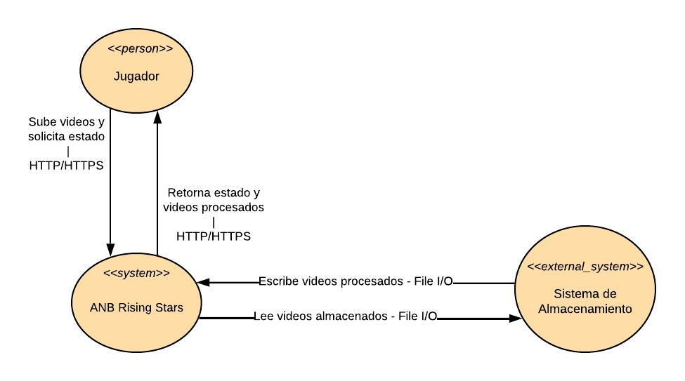
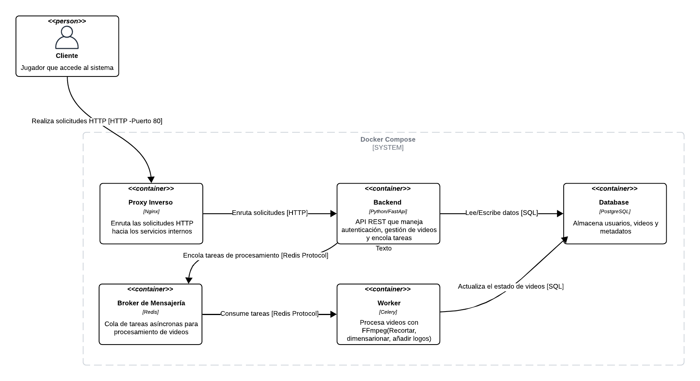
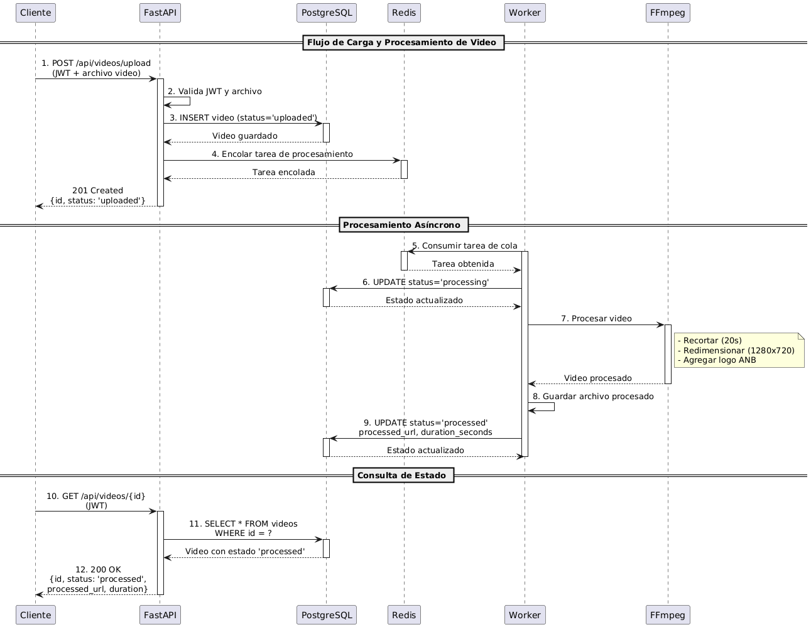

# Arquitectura del Sistema - ANB Rising Stars Showcase

## 1. Introducción

El sistema ANB Rising Stars Showcase es una aplicación web diseñada para permitir que jugadores de baloncesto suban videos mostrando sus habilidades. La arquitectura implementa un patrón de microservicios con procesamiento asíncrono, donde el backend maneja las solicitudes HTTP mientras que workers dedicados procesan los videos en segundo plano.

---

## 2. Vista de Contexto del Sistema

### 2.1 Diagrama C4 - Nivel 1: Contexto



*Diagrama que muestra: Cliente (Jugador) interactuando con el Sistema ANB Rising Stars Showcase y el Sistema de Almacenamiento, con flechas bidireccionales indicando las comunicaciones HTTP/HTTPS y File I/O.*

### 2.2 Descripción de Actores

**Cliente (Jugador)**
- Usuario que interactúa con el sistema
- Sube videos de sus habilidades
- Consulta el estado de procesamiento de sus videos
- Accede mediante HTTP/HTTPS

**Sistema ANB Rising Stars Showcase**
- Sistema central que gestiona toda la lógica de negocio
- Procesa videos automáticamente con FFmpeg
- Almacena información de usuarios y videos

**Sistema de Almacenamiento**
- Almacena videos originales y procesados
- Actualmente: Filesystem local
- Futuro: AWS S3

---

## 3. Vista de Contenedores

### 3.1 Diagrama C4 - Nivel 2: Contenedores



*Diagrama que muestra: Cliente conectándose al sistema Docker Compose que contiene 5 contenedores (Proxy Inverso, Backend FastAPI, PostgreSQL, Redis, Celery Worker) con sus respectivas conexiones y protocolos de comunicación.*

### 3.2 Componentes del Sistema dentro de Docker Compose

El sistema está compuesto por los siguientes servicios orquestados con Docker Compose:

**1. Proxy Inverso**
- Punto de entrada único para las solicitudes del cliente
- Enruta el tráfico hacia los servicios internos
- Puerto expuesto: 80

**2. Database (PostgreSQL)**
- Base de datos relacional
- Almacena usuarios, videos y metadatos
- Persistencia de datos transaccionales

**3. Backend (Python/FastAPI)**
- API REST que procesa las solicitudes HTTP
- Maneja autenticación JWT
- Coordina el flujo de trabajo entre servicios
- Lenguaje: Python con framework FastAPI

**4. Broker de Mensajería (Redis)**
- Sistema de colas para tareas asíncronas
- Coordina la comunicación entre Backend y Worker
- Almacena trabajos pendientes de procesamiento

**5. Worker (Celery)**
- Procesa videos de forma asíncrona
- Ejecuta FFmpeg para transformaciones
- Actualiza el estado de los videos en la base de datos


### 3.3 Descripción Detallada de Contenedores

#### FastAPI (API Backend)
- Contenedor: `fastapi_api`
- Puerto: 8000
- Responsabilidades:
  - Endpoints REST para autenticación (signup, login)
  - Endpoints REST para gestión de videos (upload, list, detail, delete)
  - Validación de datos con Pydantic
  - Autenticación JWT

#### Redis (Message Broker)
- Contenedor: `fastapi_redis`
- Puerto: 6379
- Responsabilidades:
  - Broker de mensajes para Celery
  - Cola de tareas de procesamiento de videos
  - Cache (opcional para optimización futura)

#### Worker (Celery Worker)
- Contenedor: `fastapi_worker`
- Sin puerto expuesto
- Responsabilidades:
  - Consumir tareas de la cola de Redis
  - Procesar videos con FFmpeg
  - Actualizar estado de videos en PostgreSQL

#### PostgreSQL (Base de Datos)
- Contenedor: `fastapi_db`
- Puerto: 5432
- Responsabilidades:
  - Almacenar usuarios (tabla `users`)
  - Almacenar videos (tabla `videos`)
  - Garantizar integridad referencial (ACID)

### 3.2 Flujo de Comunicación entre Contenedores

```
Cliente → FastAPI → PostgreSQL (consultas/escrituras)
              ↓
            Redis (encolar tarea)
              ↓
           Worker → PostgreSQL (actualizar estado)
              ↓
           FFmpeg (procesamiento de video)
```

---

## 4. Flujo de Procesamiento de Videos

### 4.1 Diagrama de Secuencia



*Diagrama que muestra los 12 pasos del flujo completo: Cliente → FastAPI → PostgreSQL → Redis → Worker → FFmpeg, dividido en 3 fases: Carga de Archivo (pasos 1-4), Procesamiento Asíncrono (pasos 5-9), y Consulta de Estado (pasos 10-12).*

**Nota:** Este diagrama está en formato PlantUML para mantener las líneas verticales continuas.

### 4.2 Carga de Archivo

**Paso 1: Cliente envía solicitud**
```
POST /api/videos/upload
Authorization: Bearer <JWT_TOKEN>
Body: multipart/form-data con archivo de video
```

**Paso 2: FastAPI recibe y valida**
- Valida JWT token (autenticación)
- Valida formato de archivo
- Valida tamaño de archivo

**Paso 3: Consulta/Entrada a Cola de Mensajes**
- FastAPI guarda metadata en PostgreSQL (estado: `uploaded`)
- Guarda archivo en filesystem temporal
- Encola tarea en Redis con ID del video

**Paso 4: FastAPI responde inmediatamente**
```json
{
  "id": "video-uuid",
  "status": "uploaded",
  "message": "Video en cola para procesamiento"
}
```

### 4.3 Procesamiento Asíncrono

**Paso 5: Worker consume tarea**
- Celery worker lee tarea de Redis
- Actualiza estado en BD: `processing`

**Paso 6: Actualiza estado a procesando**
```sql
UPDATE videos SET status = 'processing' WHERE id = 'video-uuid';
```

**Paso 7: Procesa el archivo**
Worker ejecuta FFmpeg con 3 operaciones:

1. **Recortar**: Primeros 20 segundos
   ```bash
   ffmpeg -i input.mp4 -t 20 -c copy trimmed.mp4
   ```

2. **Redimensionar**: 1280x720
   ```bash
   ffmpeg -i trimmed.mp4 -vf scale=1280:720 resized.mp4
   ```

3. **Agregar logo**: Logo ANB en esquina superior derecha
   ```bash
   ffmpeg -i resized.mp4 -i logo.png -filter_complex \
     "[1:v]scale=120:60[logo];[0:v][logo]overlay=W-w-10:10" \
     output.mp4
   ```

**Paso 8: Guarda archivo procesado**
- Guarda video procesado en filesystem
- Obtiene duración del video procesado

**Paso 9: Actualiza estado a procesado**
```sql
UPDATE videos
SET status = 'processed',
    processed_url = '/path/to/processed/video.mp4',
    duration_seconds = 20,
    processed_at = NOW()
WHERE id = 'video-uuid';
```

### 4.4 Consulta de Estado

**Paso 10: Cliente consulta estado**
```
GET /api/videos/{video_id}
Authorization: Bearer <JWT_TOKEN>
```

**Paso 11: FastAPI consulta Base de Datos**
```sql
SELECT * FROM videos WHERE id = 'video-uuid';
```

**Paso 12: Respuesta con estado actualizado**
```json
{
  "id": "video-uuid",
  "title": "Mi video",
  "status": "processed",
  "processed_url": "/videos/processed/video.mp4",
  "duration_seconds": 20,
  "uploaded_at": "2025-10-19T10:00:00Z",
  "processed_at": "2025-10-19T10:02:30Z"
}
```

### 4.5 Manejo de Errores

Si el procesamiento falla:
- Worker captura excepción
- Actualiza estado a `failed`
- Registra error en logs
- Cliente ve estado "failed" al consultar

---

## 5. Diagrama de Despliegue

### 5.1 Infraestructura Docker Compose


*Diagrama que muestra: Servidor/VM conteniendo Docker Compose con los 4 contenedores (FastAPI, PostgreSQL, Redis, Worker), los 3 volúmenes persistentes (postgres_data, video_uploads, video_processed), y las conexiones entre ellos. Cliente externo conectándose al puerto 80/8000.*

### 5.2 Componentes de Infraestructura

**Contenedores:**
- **FastAPI Container**: Puerto 8000 expuesto, conecta con todos los servicios
- **PostgreSQL Container**: Puerto 5432, con volumen `postgres_data` para persistencia
- **Redis Container**: Puerto 6379, broker de mensajes
- **Celery Worker Container**: Sin puerto expuesto, procesa tareas en background

**Volúmenes Persistentes:**
- **postgres_data**: Almacena datos de PostgreSQL (usuarios, videos, metadatos)
- **video_uploads**: Almacena videos originales subidos por usuarios (`/app/uploads`)
- **video_processed**: Almacena videos procesados por FFmpeg (`/app/processed`)

**Red Docker:**
- Red interna privada entre contenedores
- Solo FastAPI expone puerto al exterior (8000)
- Resolución DNS automática entre contenedores por nombre

---

## 6. Almacenamiento de Archivos

### 6.1 Estructura de Directorios

```
/app/
├── uploads/           # Videos originales
│   └── {user_id}/
│       └── {video_id}.mp4
├── processed/         # Videos procesados
│   └── {video_id}_processed.mp4
└── logos/
    └── anb_logo.png   # Logo para overlay
```

---

## 7. Base de Datos

### 7.1 Esquema de Tablas

**Tabla: users**
- id (UUID, PK)
- email (VARCHAR, UNIQUE)
- password (VARCHAR, hashed)
- first_name, last_name, city, country
- created_at, updated_at

**Tabla: videos**
- id (UUID, PK)
- title, description
- status (VARCHAR: uploaded/processing/processed/failed)
- original_url, processed_url
- duration_seconds
- user_id (UUID, FK → users.id)
- uploaded_at, processed_at
- created_at, updated_at

### 7.2 Índices

```sql
CREATE UNIQUE INDEX idx_users_email ON users(email);
CREATE INDEX idx_videos_user_id ON videos(user_id);
CREATE INDEX idx_videos_status_date ON videos(status, uploaded_at DESC);
```

---

## 8. CI/CD Pipeline

### 8.1 GitHub Actions

**Job 1: Tests & Linting**
- Setup Python 3.13
- Install dependencies (Poetry)
- Run flake8 (linting)
- Run black (formatting check)
- Run pytest (tests + coverage)

**Job 2: Build Docker**
- Build Docker image
- Validate docker-compose.yml
- (Futuro) Push to registry

### 8.2 Quality Gates

- Tests deben pasar (13/13)
- Coverage > 80% (actual: 88%)
- No linting errors
- Docker build exitoso

---

## 9. Tecnologías Utilizadas

### 9.1 Backend
- **Python 3.13**
- **FastAPI 0.118.x** - Framework web
- **SQLAlchemy 2.0** - ORM
- **Pydantic v2** - Validación de datos
- **python-jose** - JWT tokens
- **bcrypt** - Hashing de passwords

### 9.2 Base de Datos
- **PostgreSQL 16** - Base de datos relacional
- **Alembic** - Migraciones de BD

### 9.3 Procesamiento Asíncrono
- **Celery** - Task queue
- **Redis 7** - Message broker
- **FFmpeg** - Procesamiento de videos

### 9.4 DevOps
- **Docker** - Containerización
- **Docker Compose** - Orquestación de servicios
- **Poetry** - Gestión de dependencias
- **GitHub Actions** - CI/CD

### 9.5 Testing
- **pytest** - Framework de testing
- **pytest-cov** - Code coverage

### 9.6 Code Quality
- **flake8** - Linting (PEP 8)
- **black** - Code formatting
- **mypy** - Type checking

---

## 10. Referencias

- [FastAPI Documentation](https://fastapi.tiangolo.com/)
- [Celery Documentation](https://docs.celeryproject.org/)
- [Docker Compose Documentation](https://docs.docker.com/compose/)
- [PostgreSQL Documentation](https://www.postgresql.org/docs/)
- [FFmpeg Documentation](https://ffmpeg.org/documentation.html)
