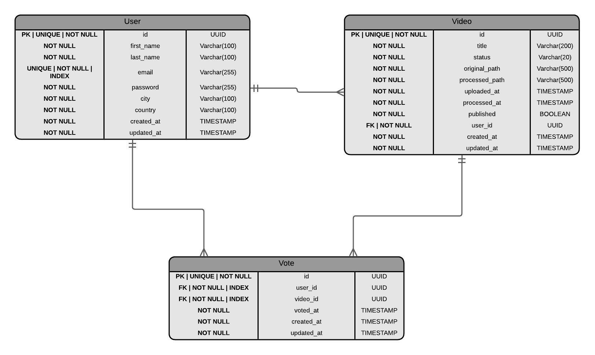

# Modelo de Datos - ANB Rising Stars Showcase

## Diagrama Entidad-Relación (ERD)



---

## Descripción de Entidades

### 1. USER (Usuarios/Jugadores)

Almacena la información de los jugadores que suben videos.

**Campos**:

| Campo | Tipo | Restricciones | Descripción |
|-------|------|---------------|-------------|
| `id` | UUID | PRIMARY KEY | Identificador único del usuario |
| `email` | VARCHAR(255) | UNIQUE, NOT NULL, INDEX | Email del usuario (login) |
| `password` | VARCHAR(255) | NOT NULL | Contraseña hasheada con bcrypt |
| `first_name` | VARCHAR(100) | NOT NULL | Nombre del jugador |
| `last_name` | VARCHAR(100) | NOT NULL | Apellido del jugador |
| `city` | VARCHAR(100) | NOT NULL | Ciudad de origen |
| `country` | VARCHAR(100) | NOT NULL | País de origen |
| `created_at` | TIMESTAMP | NOT NULL, DEFAULT NOW() | Fecha de registro |
| `updated_at` | TIMESTAMP | NOT NULL, DEFAULT NOW() | Última actualización |

**Reglas de negocio**:
- El email debe ser único en el sistema
- Las contraseñas se hashean con bcrypt (factor 12) antes de almacenar
- Un usuario puede subir múltiples videos

---

### 2. VIDEO (Videos)

Almacena información sobre los videos subidos por los jugadores.

**Campos**:

| Campo | Tipo | Restricciones | Descripción |
|-------|------|---------------|-------------|
| `id` | UUID | PRIMARY KEY | Identificador único del video |
| `title` | VARCHAR(255) | NOT NULL | Título del video |
| `description` | TEXT | NULL | Descripción del video |
| `status` | VARCHAR(50) | NOT NULL, DEFAULT 'uploaded' | Estado del procesamiento |
| `original_file_path` | VARCHAR(500) | NOT NULL | Path del video original |
| `processed_file_path` | VARCHAR(500) | NOT NULL | Path del video procesado |
| `is_published` | BOOLEAN | NOT NULL, DEFAULT FALSE | Si el video está publicado para votación |
| `user_id` | UUID | FOREIGN KEY, NOT NULL, INDEX | Referencia al usuario que subió el video |
| `created_at` | TIMESTAMP | NOT NULL, DEFAULT NOW() | Fecha de creación del registro |
| `updated_at` | TIMESTAMP | NOT NULL, DEFAULT NOW() | Última actualización |

**Estados posibles** (`status`):
- `pending`: Video subido, esperando procesamiento
- `processing`: Video siendo procesado por Celery worker
- `completed`: Video procesado exitosamente, disponible para visualización
- `failed`: Error en el procesamiento

**Reglas de negocio**:
- Cada video pertenece a un único usuario (`user_id`)
- Solo los videos con `is_published = true` y `status = 'completed'` aparecen en listados públicos
- Los videos pueden ser eliminados solo por su propietario
- Un video puede recibir múltiples votos de diferentes usuarios

**Procesamiento con FFmpeg**:
Cuando un video se sube, el worker de Celery ejecuta:
1. **Recortar**: Primeros 20 segundos (`-t 20`)
2. **Redimensionar**: 1280x720 (`scale=1280:720`)
3. **Logo**: Agregar logo ANB en esquina superior derecha

---

### 3. VOTE (Votos)

Almacena los votos que los usuarios hacen a los videos publicados.

**Campos**:

| Campo | Tipo | Restricciones | Descripción |
|-------|------|---------------|-------------|
| `id` | UUID | PRIMARY KEY | Identificador único del voto |
| `user_id` | UUID | FOREIGN KEY, NOT NULL, INDEX | Referencia al usuario que vota |
| `video_id` | UUID | FOREIGN KEY, NOT NULL, INDEX | Referencia al video votado |
| `voted_at` | TIMESTAMP | NOT NULL, DEFAULT NOW() | Fecha y hora del voto |
| `created_at` | TIMESTAMP | NOT NULL, DEFAULT NOW() | Fecha de creación del registro |
| `updated_at` | TIMESTAMP | NOT NULL, DEFAULT NOW() | Última actualización |

**Restricciones**:
- **UNIQUE** (`user_id`, `video_id`): Un usuario solo puede votar una vez por video

**Reglas de negocio**:
- Un usuario puede votar por múltiples videos
- Un usuario NO puede votar más de una vez por el mismo video
- Los votos son anónimos en el sentido de que no se muestra quién votó por qué
- Solo se muestra el conteo total de votos por video
- Un usuario NO puede votar por sus propios videos

---

## Relaciones

### USER → VIDEO (1:N)
- Un usuario puede subir **múltiples videos**
- Cada video pertenece a **un solo usuario**
- Relación: `VIDEO.user_id` → `USER.id`
- ON DELETE: CASCADE (si se elimina un usuario, se eliminan sus videos)

### USER → VOTE (1:N)
- Un usuario puede hacer **múltiples votos** (uno por cada video diferente)
- Cada voto pertenece a **un solo usuario**
- Relación: `VOTE.user_id` → `USER.id`
- ON DELETE: CASCADE (si se elimina un usuario, se eliminan sus votos)

### VIDEO → VOTE (1:N)
- Un video puede recibir **múltiples votos** (uno por cada usuario diferente)
- Cada voto está asociado a **un solo video**
- Relación: `VOTE.video_id` → `VIDEO.id`
- ON DELETE: CASCADE (si se elimina un video, se eliminan sus votos)

### Restricción UNIQUE (USER, VIDEO)
- **Constraint único**: Un usuario solo puede votar una vez por video
- Tabla: `VOTE (user_id, video_id)` UNIQUE
- Esto previene votos duplicados del mismo usuario al mismo video

---

## Índices y Optimizaciones

### Índices Principales

```sql
-- USERS: Índice único en email para login rápido
CREATE UNIQUE INDEX idx_users_email ON users(email);

-- VIDEOS: Índice en user_id para buscar videos de un usuario
CREATE INDEX idx_videos_user_id ON videos(user_id);

-- VIDEOS: Índice compuesto para listar videos procesados y publicados
CREATE INDEX idx_videos_status_published ON videos(status, is_published)
WHERE status = 'completed' AND is_published = true;

-- VOTES: Índice en user_id para buscar votos de un usuario
CREATE INDEX idx_votes_user_id ON votes(user_id);

-- VOTES: Índice en video_id para contar votos de un video
CREATE INDEX idx_votes_video_id ON votes(video_id);

-- VOTES: Constraint único para prevenir votos duplicados
CREATE UNIQUE INDEX idx_votes_unique_user_video ON votes(user_id, video_id);
```

### Optimizaciones para Consultas Frecuentes

**Ranking de jugadores por votos**:
- Consulta que agrupa votos por usuario y ordena descendente
- Índice `idx_votes_video_id` optimiza el conteo de votos
- Join con tabla `users` para obtener datos del jugador

**Videos públicos con conteo de votos**:
- Índice `idx_videos_status_published` filtra videos disponibles
- Relación con `votes` cuenta votos por video usando `idx_votes_video_id`

## Definición en SQLAlchemy

```python
from sqlalchemy import Column, String, Boolean, ForeignKey, DateTime, UniqueConstraint
from sqlalchemy.dialects.postgresql import UUID
from sqlalchemy.orm import relationship
from sqlalchemy.ext.hybrid import hybrid_property
import uuid
from datetime import datetime

class User(Base):
    """User model for ANB Rising Stars players"""
    __tablename__ = "users"

    id = Column(UUID(as_uuid=True), primary_key=True, default=uuid.uuid4)
    email = Column(String(255), unique=True, nullable=False, index=True)
    password = Column(String(255), nullable=False)  # Hasheado con bcrypt
    first_name = Column(String(100), nullable=False)
    last_name = Column(String(100), nullable=False)
    city = Column(String(100), nullable=False)
    country = Column(String(100), nullable=False)
    created_at = Column(DateTime, default=datetime.utcnow, nullable=False)
    updated_at = Column(DateTime, default=datetime.utcnow, onupdate=datetime.utcnow)

    # Relaciones
    videos = relationship("Video", back_populates="user", cascade="all, delete-orphan")
    votes = relationship("Vote", back_populates="user", cascade="all, delete-orphan")


class Video(Base):
    """Video model"""
    __tablename__ = "videos"

    id = Column(UUID(as_uuid=True), primary_key=True, default=uuid.uuid4)
    title = Column(String(255), nullable=False)
    status = Column(String(50), nullable=False, default="pending")
    original_file_path = Column(String(500), nullable=False)
    processed_file_path = Column(String(500), nullable=False)
    is_published = Column(Boolean, nullable=False, default=False)
    user_id = Column(UUID(as_uuid=True), ForeignKey("users.id"), nullable=False, index=True)
    created_at = Column(DateTime, default=datetime.utcnow, nullable=False)
    updated_at = Column(DateTime, default=datetime.utcnow, onupdate=datetime.utcnow)

    # Relaciones
    user = relationship("User", back_populates="videos")
    votes = relationship("Vote", back_populates="video", cascade="all, delete-orphan")

    @hybrid_property
    def vote_count(self):
        """Get the number of votes for this video"""
        return len(self.votes) if self.votes else 0


class Vote(Base):
    """Vote model - tracks user votes for videos"""
    __tablename__ = "votes"

    id = Column(UUID(as_uuid=True), primary_key=True, default=uuid.uuid4)
    user_id = Column(UUID(as_uuid=True), ForeignKey("users.id"), nullable=False, index=True)
    video_id = Column(UUID(as_uuid=True), ForeignKey("videos.id"), nullable=False, index=True)
    voted_at = Column(DateTime, nullable=False, default=datetime.utcnow)
    created_at = Column(DateTime, default=datetime.utcnow, nullable=False)
    updated_at = Column(DateTime, default=datetime.utcnow, onupdate=datetime.utcnow)

    # Relaciones
    user = relationship("User", back_populates="votes")
    video = relationship("Video", back_populates="votes")

    # Constraint único: un usuario solo puede votar una vez por video
    __table_args__ = (
        UniqueConstraint("user_id", "video_id", name="uq_user_video_vote"),
    )
```

---

## Casos de Uso Principales

### 1. Votar por un video
```python
# El usuario vota por un video
new_vote = Vote(
    user_id=current_user.id,
    video_id=video.id
)
db.add(new_vote)
db.commit()
```

### 2. Obtener ranking de jugadores
```python
# Obtener los jugadores con más votos
from sqlalchemy import func

ranking = (
    db.query(
        User.first_name,
        User.last_name,
        User.city,
        User.country,
        func.count(Vote.id).label("total_votes")
    )
    .join(Video, User.id == Video.user_id)
    .join(Vote, Video.id == Vote.video_id)
    .group_by(User.id)
    .order_by(func.count(Vote.id).desc())
    .all()
)
```

### 3. Verificar si un usuario ya votó
```python
# Verificar si el usuario ya votó por este video
existing_vote = (
    db.query(Vote)
    .filter(Vote.user_id == user_id, Vote.video_id == video_id)
    .first()
)
if existing_vote:
    raise ValueError("Ya has votado por este video")
```
