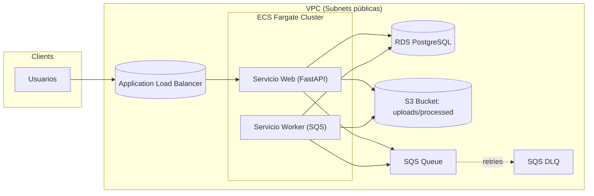

# Arquitectura AWS – Entrega 5 (ECS Fargate)

La Entrega 5 migra la plataforma de muestra de videos a contenedores gestionados en AWS ECS Fargate con autoescalado. Se mantiene el procesamiento asíncrono vía SQS y el almacenamiento en S3, con RDS PostgreSQL como base de datos administrada y un Application Load Balancer para tráfico HTTP.

## Cambios desde la entrega 4
- **ECS Fargate (en lugar de EC2/ASG):**
  - Web y Worker ahora son servicios ECS Fargate. No se administran instancias EC2.
  - Se definen `TaskDefinition` por servicio y se despliegan como `Service` con `desiredCount` dinámico.
- **Auto-Scaling por servicio:**
  - Web: autoescalado basado en métrica de CPU del servicio (target ~70%).
  - Worker: autoescalado basado en profundidad de la cola SQS (ej. 5 mensajes por tarea).
- **Imágenes multi-arquitectura corregidas:**
  - Construcción y push a ECR especificando `--platform linux/amd64` para compatibilidad con Fargate.
- **CloudFormation unificado (Fargate):**
  - Nueva plantilla `docs/Entrega_5/deployment/cloudformation/infrastructure-fargate.yaml` que provisiona red, ALB, ECR, ECS Cluster, Services, Auto Scaling Policies, RDS, S3, SQS y logs.
- **Observabilidad:**
  - Métricas de servicio ECS (CPUUtilization) y logs en CloudWatch por cada tarea (`/ecs/anb-video-web`, `/ecs/anb-video-worker`).

## Topología
- **Clientes** → **ALB** → **Servicio Web (ECS Fargate)** → **RDS PostgreSQL**
- **Servicio Web** → **S3 (uploads/processed)**
- **Servicio Web** → **SQS (VideoProcessingQueue / DLQ)**
- **Servicio Worker (ECS Fargate)**: consume SQS, procesa con MoviePy, escribe a S3 y actualiza RDS.

## Componentes
- **Networking**
  - VPC con subnets públicas multi-AZ, IGW, rutas y SGs: ALB (80), Web (desde ALB), RDS (desde Web/Worker), Worker (sin inbound público).
- **Balanceo de carga**
  - Application Load Balancer con Target Group HTTP a puerto del contenedor (`8000`). Health checks `/health`.
- **Contenedores y orquestación**
  - ECS Cluster `anb-video-cluster`.
  - Servicios:
    - `anb-video-web-service` (FastAPI, CPU target tracking).
    - `anb-video-worker-service` (worker SQS, scaling por cola).
  - Task Definitions con variables de entorno y secretos (DB URL, `SECRET_KEY`, endpoints S3/SQS).
- **Datos**
  - RDS PostgreSQL `db.t3.micro` multi-AZ (según límites del laboratorio).
  - S3 bucket para archivos de entrada/salida (presigned URLs para descargas).
  - SQS con DLQ (reintentos automáticos, máximo 3).
- **Imagen y registro**
  - ECR: repos `anb-web`, `anb-worker`. Imágenes construidas en macOS con `--platform linux/amd64`.
- **Observabilidad**
  - CloudWatch Logs por servicio/tarea.
  - Métricas de CPU de ECS y alarma para escalado.

## Flujo asíncrono (sin cambios)
1. Upload de video → guardar en S3, registro en DB `status=pending`.
2. Envío de mensaje a SQS con `video_id`.
3. Worker recibe mensajes (long polling 20s), descarga de S3.
4. Procesa (trim, resize, watermark) y sube resultado.
5. Actualiza DB `status=completed` y borra mensaje. DLQ en errores.

## Seguridad y acceso
- **IAM:** se utiliza `LabRole`. No se crean roles adicionales.
- **Seguridad de red:** SGs limitan tráfico: ALB→Web, Web/Worker→RDS, sin acceso público directo a Worker/RDS.
- **Secretos:** parámetros en CloudFormation (`DBPassword`, `SecretKey`), evitando credenciales embebidas en imágenes de Docker.

## Despliegue y operación
- Ver archivo de instrucciones de despliegue (docs/Entrega_5/deployment/deployment-instructions.md)

## Referencias
- Archivo de despliegue: `docs/Entrega_5/deployment/deployment-instructions.md`.
- Plantilla CloudFormation: `docs/Entrega_5/deployment/cloudformation/infrastructure-fargate.yaml`.
